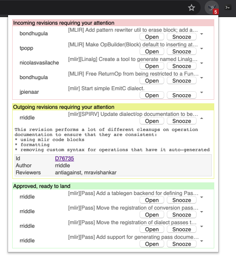

# Review Monitor for LLVM

[link-cws]: https://chrome.google.com/webstore/detail/llvm-review-monitor/fakmbnamolekigaphjbfimbebohdegma

Checks for code review updates on the llvm phabricator instance. Allows for tracking which revisions you need to review, which you need to update, and any that are ready for you to submit.

## Install

- [**Chrome** extension][link-cws]

## Screenshots

